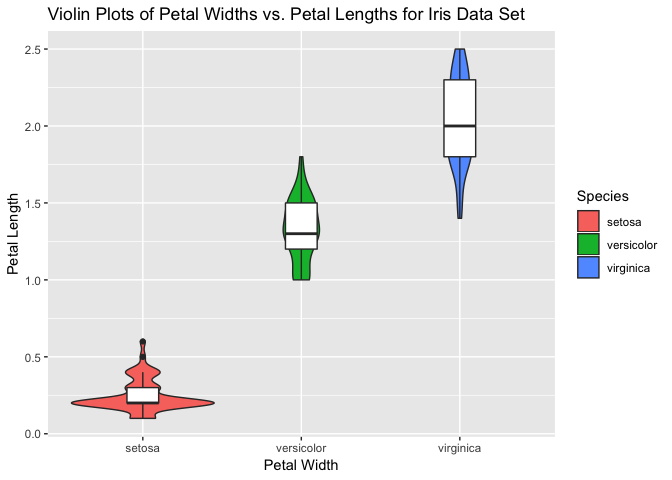
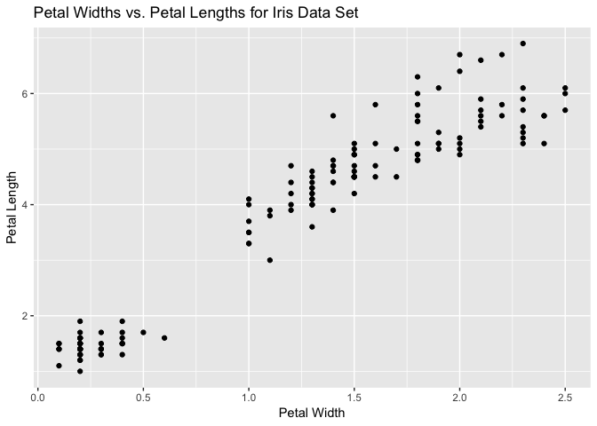
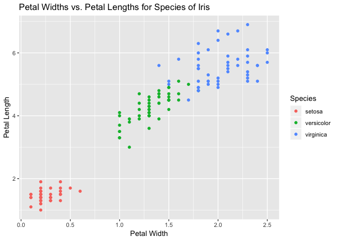
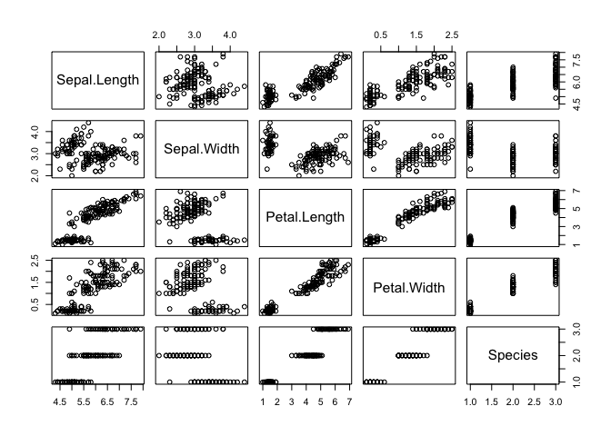

# An investigation of the iris data set

## Table of Contents:
1. [A quick introduction to the iris data](#a-quick-introduction-to-the-iris-data)
2. [Investigating the box plots by species for the iris data](#investigating-the-box-plots-for-the-iris-data)
3. [Using a bit of ggplot2 to visualize and analyze our data](#using-a-bit-of-ggplot2-to-visualize-and-analyze-our-data)
4. [Relationships between the variables](#relationships-between-the-variables)
5. [Regression Model](#regression-model)
5. [Conclusions](#conclusions)

### A quick introduction to the iris data

We will load Fisher's famous iris data set, which has measurements of petal width, petal length, sepal width and sepal length for samples of three species of iris. 

```r
data("iris")
attach(iris) # We can use attach for data we don't have to use $ to access parts of the data. For instance, instead of having to type iris$Petal.Width, we simply type Petal.Width.
```

First, let's look at the dimensions of this data set.

```r
nrow(iris) # 150 total rows of iris data
```

```
## [1] 150
```

```r
ncol(iris) # 5 columns of iris data 
```

```
## [1] 5
```

To get a peek at the first few rows of the iris data, we can look at the first few rows using the following command.


```r
# peek at top of iris data set
head(iris)
```

```
##   Sepal.Length Sepal.Width Petal.Length Petal.Width Species
## 1          5.1         3.5          1.4         0.2  setosa
## 2          4.9         3.0          1.4         0.2  setosa
## 3          4.7         3.2          1.3         0.2  setosa
## 4          4.6         3.1          1.5         0.2  setosa
## 5          5.0         3.6          1.4         0.2  setosa
## 6          5.4         3.9          1.7         0.4  setosa
```

Alternatively, we could view the last few rows by way of the tail command.

```r
# peek at bottom of iris data set
tail(iris)
```

```
##     Sepal.Length Sepal.Width Petal.Length Petal.Width   Species
## 145          6.7         3.3          5.7         2.5 virginica
## 146          6.7         3.0          5.2         2.3 virginica
## 147          6.3         2.5          5.0         1.9 virginica
## 148          6.5         3.0          5.2         2.0 virginica
## 149          6.2         3.4          5.4         2.3 virginica
## 150          5.9         3.0          5.1         1.8 virginica
```

The head and tail commands give us a feel for the data set we are working with. We don't get the whole picture, but we may be able to notice something useful. 

For example, here we may observe that the petal widths of setosa appear to be smaller than the petal widths of the flowers from the virginica species.

Next, the summary command lets us look at the the summary data which are the  Min., 1st Quartile, Median, Mean, 3rd Quartile, and Max., for the factors. Additionally, we get the number of data rows that belong to each of the species (which are setosa, versicolor, and virginica).

```r
# Summarize the iris data set all together
# This overall summary can be very useful, but there is a lot of data to deal with... So, we will pick out something that we want to know and focus on a more precise summary of the data. 
summary(iris)
```

```
##   Sepal.Length    Sepal.Width     Petal.Length    Petal.Width   
##  Min.   :4.300   Min.   :2.000   Min.   :1.000   Min.   :0.100  
##  1st Qu.:5.100   1st Qu.:2.800   1st Qu.:1.600   1st Qu.:0.300  
##  Median :5.800   Median :3.000   Median :4.350   Median :1.300  
##  Mean   :5.843   Mean   :3.057   Mean   :3.758   Mean   :1.199  
##  3rd Qu.:6.400   3rd Qu.:3.300   3rd Qu.:5.100   3rd Qu.:1.800  
##  Max.   :7.900   Max.   :4.400   Max.   :6.900   Max.   :2.500  
##        Species  
##  setosa    :50  
##  versicolor:50  
##  virginica :50  
##                 
##                 
## 
```

Since there are species of the iris, we can break down the summary by species. 


```r
# Below are the summary statistics for setosa
summary(iris[iris$Species == "setosa",])
```

```
##   Sepal.Length    Sepal.Width     Petal.Length    Petal.Width   
##  Min.   :4.300   Min.   :2.300   Min.   :1.000   Min.   :0.100  
##  1st Qu.:4.800   1st Qu.:3.200   1st Qu.:1.400   1st Qu.:0.200  
##  Median :5.000   Median :3.400   Median :1.500   Median :0.200  
##  Mean   :5.006   Mean   :3.428   Mean   :1.462   Mean   :0.246  
##  3rd Qu.:5.200   3rd Qu.:3.675   3rd Qu.:1.575   3rd Qu.:0.300  
##  Max.   :5.800   Max.   :4.400   Max.   :1.900   Max.   :0.600  
##        Species  
##  setosa    :50  
##  versicolor: 0  
##  virginica : 0  
##                 
##                 
## 
```


```r
# Below are the summary statistics for versicolor
summary(iris[iris$Species == "versicolor",])
```

```
##   Sepal.Length    Sepal.Width     Petal.Length   Petal.Width   
##  Min.   :4.900   Min.   :2.000   Min.   :3.00   Min.   :1.000  
##  1st Qu.:5.600   1st Qu.:2.525   1st Qu.:4.00   1st Qu.:1.200  
##  Median :5.900   Median :2.800   Median :4.35   Median :1.300  
##  Mean   :5.936   Mean   :2.770   Mean   :4.26   Mean   :1.326  
##  3rd Qu.:6.300   3rd Qu.:3.000   3rd Qu.:4.60   3rd Qu.:1.500  
##  Max.   :7.000   Max.   :3.400   Max.   :5.10   Max.   :1.800  
##        Species  
##  setosa    : 0  
##  versicolor:50  
##  virginica : 0  
##                 
##                 
## 
```


```r
# Below are the summary statistics for virginica
summary(iris[iris$Species == "virginica",])
```

```
##   Sepal.Length    Sepal.Width     Petal.Length    Petal.Width   
##  Min.   :4.900   Min.   :2.200   Min.   :4.500   Min.   :1.400  
##  1st Qu.:6.225   1st Qu.:2.800   1st Qu.:5.100   1st Qu.:1.800  
##  Median :6.500   Median :3.000   Median :5.550   Median :2.000  
##  Mean   :6.588   Mean   :2.974   Mean   :5.552   Mean   :2.026  
##  3rd Qu.:6.900   3rd Qu.:3.175   3rd Qu.:5.875   3rd Qu.:2.300  
##  Max.   :7.900   Max.   :3.800   Max.   :6.900   Max.   :2.500  
##        Species  
##  setosa    : 0  
##  versicolor: 0  
##  virginica :50  
##                 
##                 
## 
```

Here we can see a little bit of a clearer picture of what is going on. Since theree is a lot of data... we will keep our focus narrow. Continuing on with our petal width example from before, we can see that the virginica species has the greatest mean and median petal width whereas setosa has smallest mean and median petal widths. 

That said, we rarely just look at the summary statistics for a data set and leave it at that. We often want to look at different methods and plots to analyze the data. 

Let's see if plots match our observations.

### Investigating the box plots for the iris data

We can create side-by-side box plots of the **Petal.Width** for the different iris species.


```r
# Basic box plots for petal widths for the different iris species with axes labels
boxplot(Petal.Width~Species, xlab ="Petal Width", ylab = "Iris Species", main = "Petal Widths for the Three Iris Species")
```

<!-- -->

What can we discern from these box plots? The virginica species has the largest petal widths, whereas setosa has the smallest petal widths from this sample.

### Using a bit of ggplot2 to visualize and analyze our data
The ggplot2 package can also create the side-by-side box plots.


```r
library(ggplot2)

# Notice below how ggplot2 requires a different structre to put labels on the x-axis, y-axis and to give a main title.
ggplot(iris, mapping = aes(x = Species, y = Petal.Width)) + geom_boxplot() + labs(x = "Iris Species", y = "Petal Width") + ggtitle("Petal Widths vs. Petal Lengths for the Iris Species (Black, White, and Grey)")
```

<!-- -->

What ggplot2 allows us to do is to present data in an asthetically appealing and informative way. For instance, it is easy to add different colours for each of the iris species to the box plot.


```r
library(ggplot2)
ggplot(iris, mapping = aes(x = Species, y = Petal.Width)) + geom_boxplot(aes(fill=Species)) + labs(x = "Iris Species", y = "Petal Width") + ggtitle("Petal Widths for Iris Species (Coloured)")
```

<!-- -->

The package ggplot2 offers many other informative plots that we can use. Let's look at a few. 

Let's first look at the violin plot.

Note that violin plots have a similar function to box plots (we can see that they look sort of similar to box plots). However, a violin plot differ from a box plot in that a violin plots show the data distributions of the samples.


```r
# Note that, as before, colour is done by species 
ggplot(iris, aes(x=Species, y=Petal.Width)) + geom_violin(aes(fill=Species)) + labs(x = "Petal Width", y = "Petal Length") + ggtitle("Violin Plots of Petal Widths vs. Petal Lengths for Iris Data Set")
```

<!-- -->

In the above image, the violin plots look more like a lamps and don't appear to provide anything useful. Didn't we say they were like box plots? Therefore, shouldn't violin plots provide the same information as box plots? Note that we can add box plots to the violin plots as follows...


```r
# Note we only added the geom_boxplot() code. Nothing else changed from above. 
ggplot(iris, aes(x=Species, y=Petal.Width)) + geom_violin(aes(fill=Species)) + geom_boxplot(width=0.2) + labs(x = "Petal Width", y = "Petal Length") + ggtitle("Violin Plots of Petal Widths vs. Petal Lengths for Iris Data Set")
```

<!-- -->

In another example, suppose we want to see the relationship between **Petal.Width** and **Petal.Length**. We could use the basic ggplot code to create a plot with the data points corresponding to the **Petal.Width** and **Petal.Length**.


```r
ggplot(iris, aes(x = Petal.Width, y = Petal.Length)) + geom_point() + labs(x = "Petal Width", y = "Petal Length") + ggtitle("Petal Widths vs. Petal Lengths for Iris Data Set")
```

<!-- -->

Ok. That's pretty basic. Recall that there are three species in the iris data set: setosa, versicolor, and virginica.

We can use ggplot2 to discern the **Petal.Widths** and **Petal.Lengths** for each of the species by using color to represent the species. Now we're getting somewhere.


```r
ggplot(iris, aes(x = Petal.Width, y = Petal.Length, color = Species)) + geom_point() + labs(x = "Petal Width", y = "Petal Length") + ggtitle("Petal Widths vs. Petal Lengths for Species of Iris")
```

<!-- -->

### Relationships between the variables

If we want to see the relationships of the all the variables, we can use the simple pairs function. We can examine this plot to see if there are any relationships that indicate **collinearity**, which could mess up the coefficients of our estimates when we do regression.


```r
pairs(iris)
```

<!-- -->

### Regression model 
The pairs plot leads us into the last topic, which is regression. 

To investigate the impact of the other variables on **Petal.Width**, we can create a regression model for **Petal.Width** on **Petal.Length**, **Sepal.Length**, and **Sepal.Width**. We can compare the resulting p-values to a significance level (typically, $\alpha = 0.05$) to see if the **Petal.Length**, **Sepal.Length**, and **Sepal.Width** impact the **Petal.Width** for our chosen signficance level. 


```r
fit <- lm(Petal.Width ~ Petal.Length + Sepal.Length + Sepal.Width)
summary(fit)
```

```
## 
## Call:
## lm(formula = Petal.Width ~ Petal.Length + Sepal.Length + Sepal.Width)
## 
## Residuals:
##      Min       1Q   Median       3Q      Max 
## -0.60959 -0.10134 -0.01089  0.09825  0.60685 
## 
## Coefficients:
##              Estimate Std. Error t value Pr(>|t|)    
## (Intercept)  -0.24031    0.17837  -1.347     0.18    
## Petal.Length  0.52408    0.02449  21.399  < 2e-16 ***
## Sepal.Length -0.20727    0.04751  -4.363 2.41e-05 ***
## Sepal.Width   0.22283    0.04894   4.553 1.10e-05 ***
## ---
## Signif. codes:  0 '***' 0.001 '**' 0.01 '*' 0.05 '.' 0.1 ' ' 1
## 
## Residual standard error: 0.192 on 146 degrees of freedom
## Multiple R-squared:  0.9379,	Adjusted R-squared:  0.9366 
## F-statistic: 734.4 on 3 and 146 DF,  p-value: < 2.2e-16
```

### 6. Conclusions

We investigated the iris data set by looking at a couple of the key functions, plots and models that showed us some of the relationships between the variables. There is still a lot more that can be done, but that can be saved for a tim
