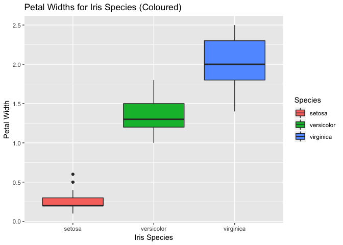

# An investigation of the iris data set

## A quick introduction to the iris data

We will load Fisher's famous iris data set, which has measurements of petal width, petal length, sepal width and sepal length for samples of three species of iris. 


```r
data("iris")
attach(iris) # We can use attach for data we don't have to use $ to access parts of the data. For instance, instead of having to type iris$Petal.Width, we simply type Petal.Width.
```

Let's look at the dimensions of this data set.

```r
nrow(iris) # 150 total rows of iris data
```

```
## [1] 150
```

```r
ncol(iris) # 5 columns of iris data 
```

```
## [1] 5
```

To get a peek at the first few rows of the iris data, we can look at the first few rows using the following command.


```r
head(iris)
```

```
##   Sepal.Length Sepal.Width Petal.Length Petal.Width Species
## 1          5.1         3.5          1.4         0.2  setosa
## 2          4.9         3.0          1.4         0.2  setosa
## 3          4.7         3.2          1.3         0.2  setosa
## 4          4.6         3.1          1.5         0.2  setosa
## 5          5.0         3.6          1.4         0.2  setosa
## 6          5.4         3.9          1.7         0.4  setosa
```

Alternatively, we could view the last few rows by way of the tail command.

```r
tail(iris)
```

```
##     Sepal.Length Sepal.Width Petal.Length Petal.Width   Species
## 145          6.7         3.3          5.7         2.5 virginica
## 146          6.7         3.0          5.2         2.3 virginica
## 147          6.3         2.5          5.0         1.9 virginica
## 148          6.5         3.0          5.2         2.0 virginica
## 149          6.2         3.4          5.4         2.3 virginica
## 150          5.9         3.0          5.1         1.8 virginica
```

The summary command lets us look at the the summary data which are the  Min., 1st Quartile, Median, Mean, 3rd Quartile, and Max, for the factors. Additionally, we get the number of data rows that belong to each of the species (which are setosa, versicolor, and virginica).

```r
summary(iris)
```

```
##   Sepal.Length    Sepal.Width     Petal.Length    Petal.Width   
##  Min.   :4.300   Min.   :2.000   Min.   :1.000   Min.   :0.100  
##  1st Qu.:5.100   1st Qu.:2.800   1st Qu.:1.600   1st Qu.:0.300  
##  Median :5.800   Median :3.000   Median :4.350   Median :1.300  
##  Mean   :5.843   Mean   :3.057   Mean   :3.758   Mean   :1.199  
##  3rd Qu.:6.400   3rd Qu.:3.300   3rd Qu.:5.100   3rd Qu.:1.800  
##  Max.   :7.900   Max.   :4.400   Max.   :6.900   Max.   :2.500  
##        Species  
##  setosa    :50  
##  versicolor:50  
##  virginica :50  
##                 
##                 
## 
```

## Investigating the underlying distribution for the iris data

Suppose we are interested in finding out whether the data is normal or not for the **Petal.Width** data. 

We can look at the shape of the histogram for the **Petal.Width** data.


```r
hist(Petal.Width)
```

<!-- -->

We can create side-by-side boxplots of the **Petal.Width** for the different iris species.


```r
boxplot(Petal.Width~Species, xlab ="Petal Width", ylab = "Iris Species")
```

<!-- -->


## Using a bit of ggplot2 to visualize and analyze our data
The ggplot2 package can also create the side-by-side boxplots.


```r
library(ggplot2)
ggplot(iris, mapping = aes(x = Species, y = Petal.Width)) + geom_boxplot() + labs(x = "Iris Species", y = "Petal Width")
```

<!-- -->

What ggplot allows us to do is to present data in an asthetically appealing and informative way. For instance, it is easy to add different colours for each of the iris species to the boxplot.


```r
library(ggplot2)
ggplot(iris, mapping = aes(x = Species, y = Petal.Width)) + geom_boxplot(aes(fill=Species)) + labs(x = "Iris Species", y = "Petal Width")
```

<!-- -->

The package ggplot offers many other informative plots that we can use. Let's look at a few. 

For example, suppose we wanted to vizualize the relationship between **Petal.Width** and **Petal.Length**. We could use the basic ggplot code to create a plot with the data points corresponding to the **Petal.Width** and **Petal.Length**.


```r
ggplot(iris, aes(x = Petal.Width, y = Petal.Length)) + geom_point()
```

<!-- -->

Ok. That's pretty basic. Recall that there are three species in the iris data set: setosa, versicolor, and virginica.

We can use ggplot to discern the **Petal.Widths** and **Petal.Lengths** for each of the species by using color to represent the species. 


```r
ggplot(iris, aes(x = Petal.Width, y = Petal.Length, color = Species)) + geom_point()
```

<!-- -->

## Relationships between the variables

If we want to see the relationships of the all the variables, we can use the simple pairs function


```r
pairs(iris)
```

<!-- -->

## Regression model 

To investigate the impact of the other variables on **Petal.Width**, we can create a regression model for **Petal.Width** on **Petal.Length**, **Sepal.Length**, and **Sepal.Width**. We can compare the resulting p-values to a significance level (typically, $\alpha = 0.05$) to see if the **Petal.Length**, **Sepal.Length**, and **Sepal.Width** impact the **Petal.Width** for our chosen signficance level. 


```r
fit <- lm(Petal.Width ~ Petal.Length + Sepal.Length + Sepal.Width)
summary(fit)
```

```
## 
## Call:
## lm(formula = Petal.Width ~ Petal.Length + Sepal.Length + Sepal.Width)
## 
## Residuals:
##      Min       1Q   Median       3Q      Max 
## -0.60959 -0.10134 -0.01089  0.09825  0.60685 
## 
## Coefficients:
##              Estimate Std. Error t value Pr(>|t|)    
## (Intercept)  -0.24031    0.17837  -1.347     0.18    
## Petal.Length  0.52408    0.02449  21.399  < 2e-16 ***
## Sepal.Length -0.20727    0.04751  -4.363 2.41e-05 ***
## Sepal.Width   0.22283    0.04894   4.553 1.10e-05 ***
## ---
## Signif. codes:  0 '***' 0.001 '**' 0.01 '*' 0.05 '.' 0.1 ' ' 1
## 
## Residual standard error: 0.192 on 146 degrees of freedom
## Multiple R-squared:  0.9379,	Adjusted R-squared:  0.9366 
## F-statistic: 734.4 on 3 and 146 DF,  p-value: < 2.2e-16
```
